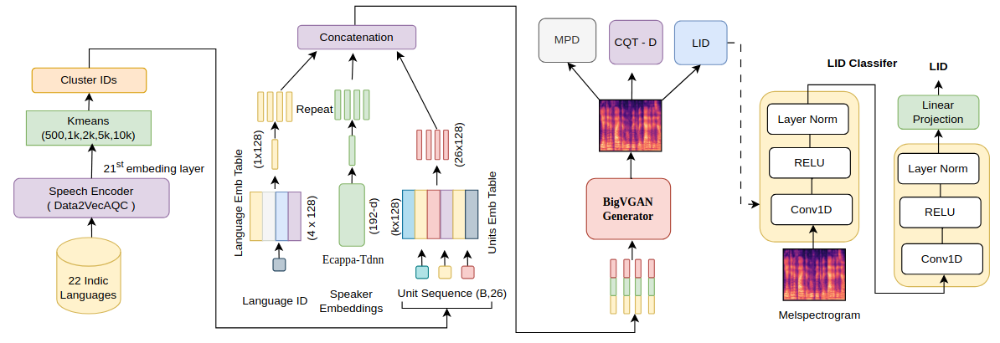

## Multilingual Multi-Speaker Unit Vocoders: A Systematic Analysis of Discrete Speech Representations

#### Naman Kothari, Arjun Gangwar, Adarsh Arigala, S Umesh

[[Paper]](https://arxiv.org/pdf/2606.06740) - [[Code]](https://github.com/Naman-kothari-10/UnitBigVGAN) 


<p align="center">
  
</p>

## Overview

UnitBigVGAN is a neural vocoder based on **BigVGAN** that synthesizes high-quality waveforms from discrete speech representations or units. This work demonstrates a comprehensive analysis of unit-based vocoders that support multiple languages and speakers.


## Installation


### Step 1: Create Conda Environment


```bash
conda create -n unitbigvgan python=3.10 pytorch torchvision torchaudio pytorch-cuda=12.1 -c pytorch -c nvidia
conda activate unitbigvgan
```


### Step 2: Clone Repository

```bash
git clone https://github.com/Naman-kothari-10/UnitBigVGAN.git
cd UnitBigVGAN
```

### Step 3: Install Dependencies

```bash
pip install -r requirements.txt
```

## General Training Command

```bash
python train.py \
    --config configs_codebigvgan/config.json \
    --checkpoint_path ./checkpoints/dir \
    --input_wavs_dir /path/to/audio/files \
    --input_training_file /path/to/train_files.txt \
    --input_validation_file /path/to/val_files.txt \
    --training_unit_file /path/to/training_units_uc \
    --validation_unit_file /path/to/validation_units_uc \
    --ecapa_tdnn_spk_emb_scp_file /path/to/speaker_embeddings.scp \
    --training_utt2lang_path /path/to/espnet_format/train_utt2lang.txt \
    --validation_utt2lang_path /path/to/espnet_format/val_utt2lang.txt \
```

> `train.py` supports training with different configurations. Modify the configuration file or command line arguments to reproduce different experimental settings.


### Training Data Format

**File Lists:** 
```
# train_files.txt
audio001|/path/to/audio001.wav
audio002|/path/to/audio002.wav
audio003|/path/to/audio003.wav
```

**Unit Files:** :
```
# training_units_uc
audio001 145 203 87 45 12 345 ...
audio002 234 56 789 234 12 ...
audio003 124 54 236 5 11 ...
```
**Speaker Embedding manifest**
```
# spk_emb_manifest
audio001 /path/to/spk/emb/audio001.wav
audio002 /path/to/spk/emb/audio002.wav
audio003 /path/to/spk/emb/audio003.wav
```


---

## Inference


```bash
python inference_code.py \
    --input_wavs_dir /path/to/input/audio \
    --output_dir ./inference_outputs \
    --checkpoint_file ./checkpoints/path/ \
    --unit_filepath /path/to/unit_sequences \
    --config_filepath configs_codebigvgan/config.json \
    --ecapa_tdnn_spk_emb_scp_file /path/to/speaker_embeddings.scp
    --lang_ids_json_path /path/to/lang_id/map.json \
    --utt2lang_path /path/to/espnet_format/train_utt2lang \
```


### Configuration Parameters

Key configuration options in JSON files:

```json
{
  "num_gpus": 4,                        # Number of GPUs
  "batch_size": 64,                     # Batch size per GPU
  "learning_rate": 0.0001,              # Initial learning rate
  "sampling_rate": 16000,               # Audio sample rate
  "num_mels": 80,                       # Mel-spectrogram bands
  "segment_size": 8320,                 # Training segment length (samples)
  "num_kmeans_units": 1000,             # Number of units (1k/5k/10k)
  "unit_emb_dim": 128,                  # Unit embedding dimension
  "upsample_rates": [5,4,2,2,2,2],     # Upsampling layers
  "upsample_kernel_sizes": [10,8,4,4,4,4],
  "activation": "snakebeta",            # Activation function
  "use_cqtd_instead_of_mrd": true,     # CQTD discriminator (better)
  "is_multilingual": true,             # Multilingual support
  "is_multispkr": true,                # Multi-speaker support
  "checkpoint_interval": 5000,          # Save checkpoint every N steps
  "validation_interval": 5000           # Validate every N steps
}
```
# Acknowledgments

This project builds upon **BigVGAN**. We thank the BigVGAN authors for open sourcing their work and advancing neural vocoding research.

- BigVGAN: A Universal Neural Vocoder with Large-Scale Generative Modeling
- [BigVGAN Repository](https://github.com/NVIDIA/BigVGAN)
```


